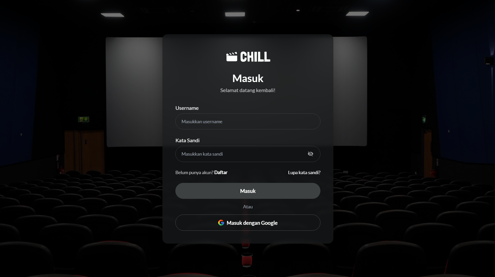
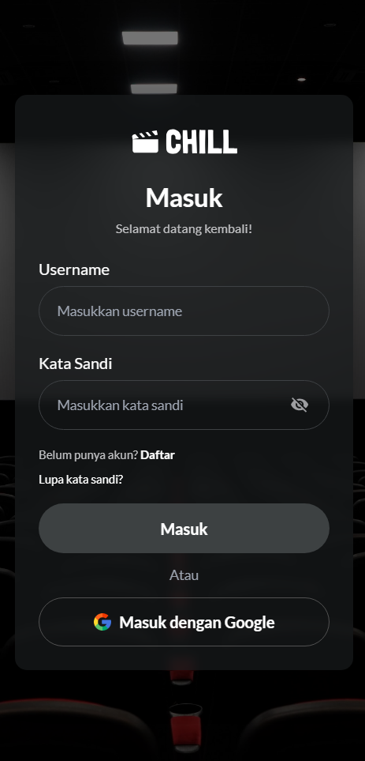
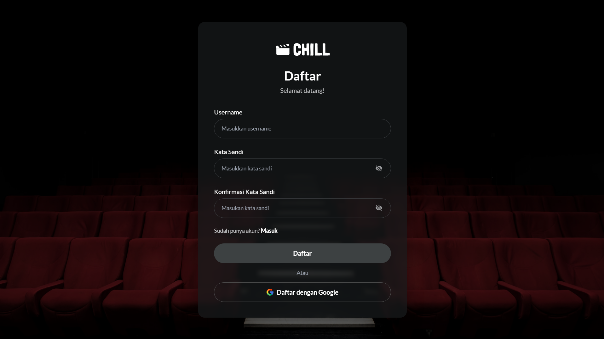
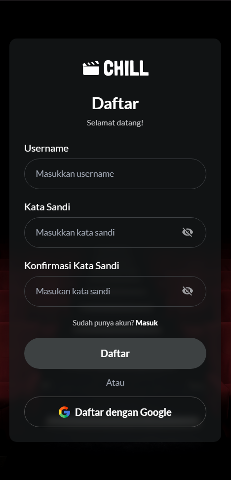

# 🎬 CHILL Movie App

CHILL Movie App adalah aplikasi streaming film berbasis React yang terinspirasi dari platform seperti Netflix dan Disney+. Project ini dibuat sebagai tugas Bootcamp Full Stack Developer HariSenin dengan fokus pada pembuatan antarmuka modern, reusable component, dan responsive design.

---

## ✨ Features

- 🔐 Login Page
- 📝 Register Page
- 🏠 Homepage
- 🎞 Hero Banner
- 🎬 Movie & Series Sections
- 🎠 Horizontal Carousel
- 🎥 Movie & Series Detail Popup
- 📺 Episode List
- 🎯 Recommendation Section
- 📱 Fully Responsive Design
- 🎨 Modern UI Design
- 🧩 Reusable React Components

---

## 🛠 Tech Stack

- React
- Vite
- React Responsive
- CSS3
- JavaScript (ES6)

---

## 📂 Folder Structure

```text
src
│
├── assets
│   ├── icons
│   ├── images
│   └── readme
│
├── components
│   ├── Button
│   ├── Footer
│   ├── Input
│   ├── MovieCard
│   ├── MoviePopup
│   ├── MoviePreview
│   └── Navbar
│
├── data
│   ├── movies.js
│   └── series.js
│
├── features
│   └── home
│       └── Hero
│       └── MovieSection
│           └── series.js
│
├── pages
│   ├── Home
│   ├── Login
│   └── Register
│
├── styles
│   └── Global.css
│
├── App.jsx
└── main.jsx
```

---

## 📱 Responsive

This project is fully responsive and optimized for:

- 💻 Desktop
- 📱 Mobile (375px)

Responsive implementation uses:

- react-responsive
- CSS Media Query

---

## 🚀 Getting Started

Clone this repository

```bash
git clone https://github.com/yamadwi/CHILL-MOVIE-APP.git
```

Go to the project folder

```bash
cd CHILL-MOVIE-APP
```

Install dependencies

```bash
npm install
```

Run development server

```bash
npm run dev
```

---

## 📸 Preview

### Login Page

| Desktop                            | Mobile                                        |
| ---------------------------------- | --------------------------------------------- |
|  |  |

### Register Page

| Desktop                               | Mobile                                           |
| ------------------------------------- | ------------------------------------------------ |
|  |  |

### Homepage

| Desktop                            | Mobile                                        |
| ---------------------------------- | --------------------------------------------- |
|  |  |

### Movie Detail Popup

| Desktop                            | Mobile                                        |
| ---------------------------------- | --------------------------------------------- |
|  |  |

### Responsive Mobile

| Desktop                            | Mobile                                        |
| ---------------------------------- | --------------------------------------------- |
|  |  |

---

## 👨‍💻 Author

**Yama Dwi Yulianto**

- GitHub : https://github.com/yamadwi

---

## 🙏 Acknowledgements

This project was developed as part of the **HariSenin Full Stack Developer Bootcamp**.

The UI design is inspired by modern streaming platforms such as **Netflix** and **Disney+**, and was created solely for educational purposes.
